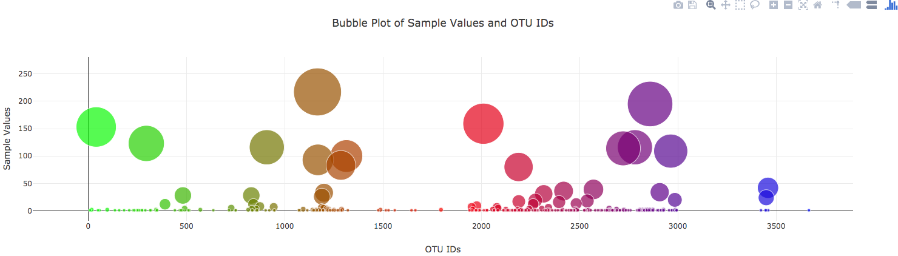

# Belly Button Biodiversity
 

 

## Deploy your Flask app to Heroku. 
 

[Click here to visit deployed app to Heroku](https://another-belly-button-app.herokuapp.com/)


```python
from IPython.display import Image
```


```python
 
Image(filename='./dashboard.png')
```


```python
 
Image(filename='./pie-metadata-selection.png')
```


```python
 
Image(filename='./bubble-chart.png')
```





In this assignment, you will build an interactive dashboard to explore the [Belly Button Biodiversity DataSet](http://robdunnlab.com/projects/belly-button-biodiversity/).

# Step 1 - Flask API
Use Flask to design an API for your dataset and to serve the HTML and JavaScript required for your dashboard page. Note: We recommend using the sqlite database file and SQLAlchemy inside of your Flask application code, but you are permitted to read the CSV data directly into Pandas DataFrames for this assignment. You will still need to output the data as JSON in the format specified in the routes below.

First, create a template called index.html for your dashboard landing page. Use the Bootstrap grid system to create the structure of the dashboard page.

Next, create the following routes for your api.

@app.route("/")
    """Return the dashboard homepage."""
@app.route('/names')
    """List of sample names.

    Returns a list of sample names in the format
    [
        "BB_940",
        "BB_941",
        "BB_943",
        "BB_944",
        "BB_945",
        "BB_946",
        "BB_947",
        ...
    ]

    """
@app.route('/otu')
    """List of OTU descriptions.

    Returns a list of OTU descriptions in the following format

    [
        "Archaea;Euryarchaeota;Halobacteria;Halobacteriales;Halobacteriaceae;Halococcus",
        "Archaea;Euryarchaeota;Halobacteria;Halobacteriales;Halobacteriaceae;Halococcus",
        "Bacteria",
        "Bacteria",
        "Bacteria",
        ...
    ]
    """
@app.route('/metadata/<sample>')
    """MetaData for a given sample.

    Args: Sample in the format: `BB_940`

    Returns a json dictionary of sample metadata in the format

    {
        AGE: 24,
        BBTYPE: "I",
        ETHNICITY: "Caucasian",
        GENDER: "F",
        LOCATION: "Beaufort/NC",
        SAMPLEID: 940
    }
    """
@app.route('/wfreq/<sample>')
    """Weekly Washing Frequency as a number.

    Args: Sample in the format: `BB_940`

    Returns an integer value for the weekly washing frequency `WFREQ`
    """
@app.route('/samples/<sample>')
    """OTU IDs and Sample Values for a given sample.

    Sort your Pandas DataFrame (OTU ID and Sample Value)
    in Descending Order by Sample Value

    Return a list of dictionaries containing sorted lists  for `otu_ids`
    and `sample_values`

    [
        {
            otu_ids: [
                1166,
                2858,
                481,
                ...
            ],
            sample_values: [
                163,
                126,
                113,
                ...
            ]
        }
    ]
    """

# Step 2 - Plotly.js
 

Use Plotly.js to build interactive charts for your dashboard.

Use the route /names to populate a dropdown select element with the list of sample names.

Use document.getElementById, document.createElement and append to populate the create option elements and append them to the dropdown selector.

Use the following HTML tag for the dropdown selector

<select id="selDataset" onchange="optionChanged(this.value)"></select>
Create a function called optionChanged to handle the change event when a new sample is selected (i.e. fetch data for the newly selected sample).
dropdown

Create a PIE chart that uses data from your routes /samples/<sample> and /otu to display the top 10 samples.

Use the Sample Value as the values for the PIE chart

Use the OTU ID as the labels for the pie chart

Use the OTU Description as the hovertext for the chart

Use Plotly.restyle to update the chart whenever a new sample is selected

PIE Chart

Create a Bubble Chart that uses data from your routes /samples/<sample> and /otu to plot the Sample Value vs the OTU ID for the selected sample.

Use the OTU IDs for the x values

Use the Sample Values for the y values

Use the Sample Values for the marker size

Use the OTU IDs for the marker colors

Use the OTU Description Data for the text values

Use Plotly.restyle to update the chart whenever a new sample is selected

Bubble Chart

Display the sample metadata from the route /metadata/<sample>

Display each key/value pair from the metadata JSON object somewhere on the page

Update the metadata for each sample that is selected

You are welcome to create any layout that you would like for your dashboard. An example dashboard page might look something like the following.

Example Dashboard Page Example Dashboard Page

Finally, deploy your Flask app to Heroku.
 


```python
Image(filename='./bacteria_by_filterforgedotcom.jpg')
```


# Optional Challenge Assignment
The following task is completely optional

Adapt the Gauge Chart from https://plot.ly/javascript/gauge-charts/ to plot the Weekly Washing Frequency obtained from the route /wfreq/<sample>

You will need to modify the example gauge code to account for values ranging from 0 - 9.

Use Plotly.restyle to update the chart whenever a new sample is selected

Weekly Washing Frequency Gauge

## Hints
Use Plotly.d3.json to fetch data for all of your api routes

Refer to the Plotly.js Documentation when building the plots

Use Bootstrap to structure your HTML template.

Use Pandas inside of your Flask routes to help format, filter, or sort the data before converting to JSON

© 2018 GitHub, Inc.
Terms
Privacy
Security
Status
Help
Contact GitHub
API
Training
Shop
Blog
About
